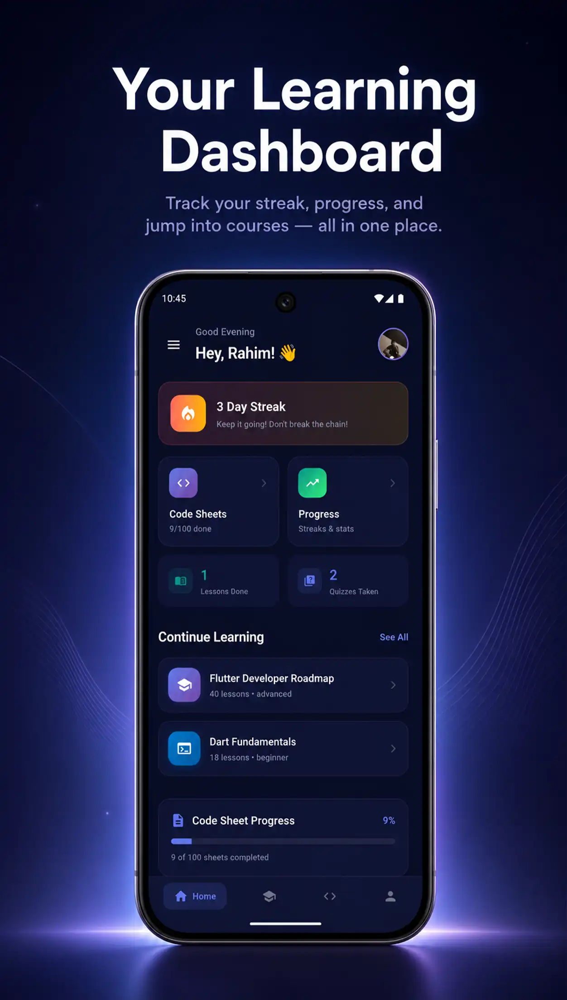

<div align="center">

# 📱 Flutter Code Sheet

### Learn Dart & Flutter — One Lesson at a Time

[](https://flutter.dev)
[](https://dart.dev)
[](LICENSE)
[](#-available-courses)
[](https://play.google.com/store/apps/details?id=com.gymli.app)

<br/>

**Flutter Code Sheet** is a free mobile learning app that teaches **Dart** and **Flutter** from absolute zero.  
Every lesson in the app is paired with runnable source code in this repo — browse, run, and modify real examples as you learn.

<br/>

[**Download the App**](https://play.google.com/store/apps/details?id=com.gymli.app) · [**Explore Courses**](#-available-courses) · [**Get Started**](#-quick-start)

</div>

<br/>

---

<br/>

## ✨ App Preview

<div align="center">

<table>
  <tr>
    <td align="center"><br/><b>Dashboard</b></td>
    <td align="center"><br/><b>Courses List</b></td>
    <td align="center"><br/><b>Course Details</b></td>
  </tr>
  <tr>
    <td align="center"><br/><b>Lesson Content</b></td>
    <td align="center"><br/><b>Cheat Sheets</b></td>
    <td align="center"><br/><b>Daily Progress</b></td>
  </tr>
</table>

</div>

<br/>

---

<br/>

## 📚 Available Courses

> **13 structured courses** covering everything from Dart basics to production-ready Flutter architecture.  
> Each course thumbnail below links to its source code folder in this repository.

<br/>

<div align="center">
<table>
  <tr>
    <td align="center" width="33%">
      <a href="courses/flutter-developer-roadmap">
        <br/>
        <b>Flutter Developer Roadmap</b>
      </a><br/>
      <sub>Your complete learning path</sub>
    </td>
    <td align="center" width="33%">
      <a href="courses/dart-fundamentals">
        <br/>
        <b>Dart Fundamentals</b>
      </a><br/>
      <sub>Variables, functions, OOP & more</sub>
    </td>
    <td align="center" width="33%">
      <a href="courses/flutter-basics">
        <br/>
        <b>Flutter Basics</b>
      </a><br/>
      <sub>Widgets, layouts & your first app</sub>
    </td>
  </tr>
  <tr><td colspan="3">&nbsp;</td></tr>
  <tr>
    <td align="center" width="33%">
      <a href="courses/flutter-ui-layouts">
        <br/>
        <b>Flutter UI & Layouts</b>
      </a><br/>
      <sub>Beautiful interfaces & responsive design</sub>
    </td>
    <td align="center" width="33%">
      <a href="courses/flutter-navigation-forms">
        <br/>
        <b>Navigation & Forms</b>
      </a><br/>
      <sub>Routing, navigation & form handling</sub>
    </td>
    <td align="center" width="33%">
      <a href="courses/flutter-state-management-basics">
        <br/>
        <b>State Management Basics</b>
      </a><br/>
      <sub>setState, InheritedWidget & Provider</sub>
    </td>
  </tr>
  <tr><td colspan="3">&nbsp;</td></tr>
  <tr>
    <td align="center" width="33%">
      <a href="courses/riverpod-for-flutter-apps">
        <br/>
        <b>Riverpod for Flutter</b>
      </a><br/>
      <sub>Modern reactive state management</sub>
    </td>
    <td align="center" width="33%">
      <a href="courses/flutter-local-storage-offline-apps">
        <br/>
        <b>Local Storage & Offline Apps</b>
      </a><br/>
      <sub>SharedPrefs, Hive, SQLite & more</sub>
    </td>
    <td align="center" width="33%">
      <a href="courses/flutter-api-integration">
        <br/>
        <b>API Integration</b>
      </a><br/>
      <sub>REST APIs, HTTP, JSON & Dio</sub>
    </td>
  </tr>
  <tr><td colspan="3">&nbsp;</td></tr>
  <tr>
    <td align="center" width="33%">
      <a href="courses/firebase-for-flutter-apps">
        <br/>
        <b>Firebase for Flutter</b>
      </a><br/>
      <sub>Auth, Firestore, Storage & more</sub>
    </td>
    <td align="center" width="33%">
      <a href="courses/supabase-for-flutter-apps">
        <br/>
        <b>Supabase for Flutter</b>
      </a><br/>
      <sub>Open-source Firebase alternative</sub>
    </td>
    <td align="center" width="33%">
      <a href="courses/flutter-clean-architecture">
        <br/>
        <b>Clean Architecture</b>
      </a><br/>
      <sub>Scalable, testable app structure</sub>
    </td>
  </tr>
  <tr><td colspan="3">&nbsp;</td></tr>
  <tr>
    <td align="center" width="33%">
      <a href="courses/flutter-app-publishing-monetization">
        <br/>
        <b>Publishing & Monetization</b>
      </a><br/>
      <sub>Play Store, App Store & AdMob</sub>
    </td>
    <td align="center" width="33%"></td>
    <td align="center" width="33%"></td>
  </tr>
</table>
</div>

<br/>

---

<br/>

## 🗂 Repository Structure

```
flutter-code-sheet-courses/
├── assets/
│   ├── images/          → App screenshots
│   └── thumbnails/      → Course thumbnail images
├── courses/
│   ├── dart-fundamentals/
│   ├── flutter-basics/
│   ├── flutter-ui-layouts/
│   ├── flutter-navigation-forms/
│   ├── flutter-state-management-basics/
│   ├── riverpod-for-flutter-apps/
│   ├── flutter-local-storage-offline-apps/
│   ├── flutter-api-integration/
│   ├── firebase-for-flutter-apps/
│   ├── supabase-for-flutter-apps/
│   ├── flutter-clean-architecture/
│   ├── flutter-app-publishing-monetization/
│   └── flutter-developer-roadmap/
├── docs/                → Guides & contribution rules
└── scripts/             → Utility scripts
```

Each course follows a consistent structure:

```
course-name/
├── course-info.json                  ← Course metadata
├── README.md                         ← Course overview & lesson index
├── module-01-topic-name/
│   ├── lesson-01-lesson-title/
│   │   ├── README.md                 ← Lesson explanation
│   │   └── main.dart                 ← Runnable code example
│   └── ...
└── ...
```

<br/>

---

<br/>

## 🚀 Quick Start

### Dart (Console) Examples

```bash
# Navigate to any lesson folder
cd courses/dart-fundamentals/module-01-getting-started/lesson-01-what-is-dart/

# Run the example
dart run main.dart
```

### Flutter Examples

```bash
# Navigate to a Flutter lesson folder
cd courses/flutter-basics/module-01-getting-started/lesson-01-what-is-flutter/

# Run the Flutter app
flutter run
```

> **💡 Tip:** You can also paste Dart examples directly into [DartPad](https://dartpad.dev) to run them in the browser — no setup needed!

<br/>

---

<br/>

## 📲 Get the App

<div align="center">

Download **Flutter Code Sheet** for guided lessons, quizzes, cheat sheets, and progress tracking.

<br/>

<a href="https://play.google.com/store/apps/details?id=com.gymli.app">
  
</a>

</div>

<br/>

---

<br/>

## 📄 License

This project is licensed under the **MIT License** — see the [LICENSE](LICENSE) file for details.

<br/>

<div align="center">

---

<br/>

Made with ❤️ for Flutter learners everywhere.

<br/>

**[⬆ Back to Top](#-flutter-code-sheet)**

</div>
